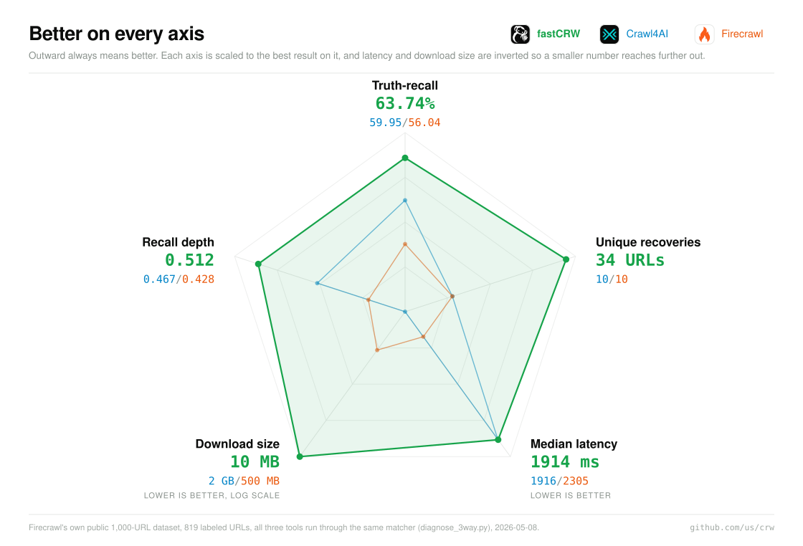

<p align="center">
  
</p>

<h1 align="center">fastCRW</h1>

<p align="center">
  Turn URLs into clean <strong>markdown</strong> or structured
  <strong>JSON</strong> with one engine for search, scrape, map, crawl, and extract.
</p>

<p align="center">
  Run it locally as a small Rust binary or use the managed API.
</p>

<p align="center">
  <a href="#install"><strong>Run locally ↓</strong></a> ·
  <a href="https://fastcrw.com/register"><strong>Start free</strong></a> ·
  <a href="https://docs.fastcrw.com"><strong>Docs</strong></a>
</p>

<p align="center">
  <a href="https://crates.io/crates/crw-server"></a>
  <a href="https://pypi.org/project/crw/"></a>
  <a href="https://www.npmjs.com/package/crw-mcp"></a>
  <a href="https://github.com/us/crw/actions/workflows/ci.yml"></a>
  <a href="LICENSE"></a>
  <a href="https://github.com/us/crw/stargazers"></a>
</p>

On Firecrawl's own public benchmark dataset, fastCRW led every axis measured,
against Crawl4AI and Firecrawl run over the same URLs through the same matcher,
while idling at **~14 MB RAM**.

<p align="center">
  <a href="BENCHMARKS.md">
    
  </a>
</p>

<p align="center"><sub><a href="BENCHMARKS.md">Methodology and one-command reproduction</a></sub></p>

## Install

```bash
curl -fsSL https://fastcrw.com/install | sh
```

Start scraping immediately—basic local use needs no account, API key, or
setup. The installer supports macOS and Linux on Intel and ARM; other methods
are in the [installation guide](https://docs.fastcrw.com/installation/).

## What it does

| Operation | Outcome |
|---|---|
| **Scrape** | One URL to markdown, HTML, links, screenshots, or schema JSON |
| **Crawl** | Follow a bounded site crawl and collect its pages |
| **Map** | Discover URLs without scraping every page |
| **Search** | Search the web and optionally scrape selected results |
| **Extract** | Produce structured fields from one or many URLs |

Full request and response contracts belong in the
[API reference](https://docs.fastcrw.com/#rest-api), not this landing page.

## Choose how you use it

### CLI

```bash
crw https://example.com
crw search "rust async runtime"
```

### REST and SDKs

Use the [REST API reference](https://docs.fastcrw.com/#rest-api),
[Python SDK](https://docs.fastcrw.com/sdk-examples/#python), or
[Node.js SDK](https://docs.fastcrw.com/sdk-examples/#typescript). The guides
cover both managed and self-hosted configuration.

### MCP for AI agents

```bash
npx -y crw-mcp@latest install
```

This registers the CRW skill and MCP server in detected supported agent hosts.
With no API key it uses the local embedded engine. See
[per-client setup](https://docs.fastcrw.com/mcp-clients/) for manual registration
and cloud mode.

### Optional setup

```bash
crw setup
```

Run setup only when you want to connect a Cloud API key or add local browser
rendering and web search. AI features ask for an LLM provider only when you
first invoke `--summary` or `--extract`.

## Choose where it runs

| | Managed API | Local / self-hosted |
|---|---|---|
| Best for | Zero infrastructure and managed scaling | Data control, private networks, or custom infrastructure |
| Start | [Create an API key](https://fastcrw.com/register), then `crw setup` | Install and run `crw <URL>` |
| Operations | Managed proxies, billing, and hosted capabilities | You choose renderers, search, auth, proxies, and capacity |

Both modes expose the core engine operations, but deployment capabilities,
billing fields, and some response envelopes can differ. Check
[`/v1/capabilities`](https://docs.fastcrw.com/capabilities/) and the
[response-shape guide](https://docs.fastcrw.com/response-shapes/) instead of
assuming that changing only the base URL makes every deployment identical.

For deployment, authentication, containers, and production hardening, use the
[self-hosting guide](https://docs.fastcrw.com/self-hosting/).

## Learn more

- [Quickstart](https://docs.fastcrw.com/quick-start/)
- [API reference](https://docs.fastcrw.com/#rest-api)
- [Benchmarks](BENCHMARKS.md)
- [Firecrawl migration](COMPATIBILITY-firecrawl.md)
- [Self-hosting](https://docs.fastcrw.com/self-hosting/)

## Contributing

The workspace requires Rust 1.85 or newer:

```bash
git clone https://github.com/us/crw
cd crw
make check-fast
```

Read [CONTRIBUTING.md](CONTRIBUTING.md) for the architecture, repository map, and
full pre-merge checks.

fastCRW is open source under [AGPL-3.0](LICENSE). Calling either a managed or
self-hosted API does not apply the engine license to your client code. Commercial
licensing for embedding the engine is available at hello@fastcrw.com.

## Star History

<a href="https://www.star-history.com/?repos=us%2Fcrw&type=date&legend=top-left">
 <picture>
   <source media="(prefers-color-scheme: dark)" srcset="https://api.star-history.com/chart?repos=us/crw&type=date&theme=dark&legend=top-left&sealed_token=Pe6pRWL7lqTM-St9eo-Cmpk5kYNyuyun0krw9eVZQFIrm3g_R2h46IW6wfNalPXquMsWSNCgKqiar1YVo9MGy2IZmN5Lz6rjZcjBCw6bCcRHORKORFRi9A" />
   <source media="(prefers-color-scheme: light)" srcset="https://api.star-history.com/chart?repos=us/crw&type=date&legend=top-left&sealed_token=Pe6pRWL7lqTM-St9eo-Cmpk5kYNyuyun0krw9eVZQFIrm3g_R2h46IW6wfNalPXquMsWSNCgKqiar1YVo9MGy2IZmN5Lz6rjZcjBCw6bCcRHORKORFRi9A" />
   
 </picture>
</a>

<details>
<summary>Contributors</summary>

<!-- contributors:start -->
<p align="center">
  <a href="https://github.com/us" title="us"></a>
  <a href="https://github.com/santhreal" title="santhreal"></a>
  <a href="https://github.com/AsheTheWings" title="AsheTheWings"></a>
  <a href="https://github.com/adambenhassen" title="adambenhassen"></a>
  <a href="https://github.com/paoloantinori" title="paoloantinori"></a>
  <a href="https://github.com/mj520" title="mj520"></a>
</p>
<!-- contributors:end -->

</details>

<sub>End users are responsible for respecting websites' policies when scraping.
fastCRW respects `robots.txt` directives by default.</sub>
